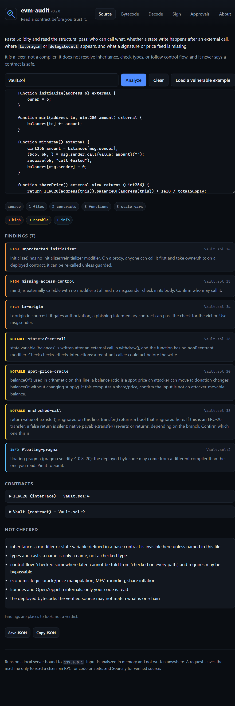
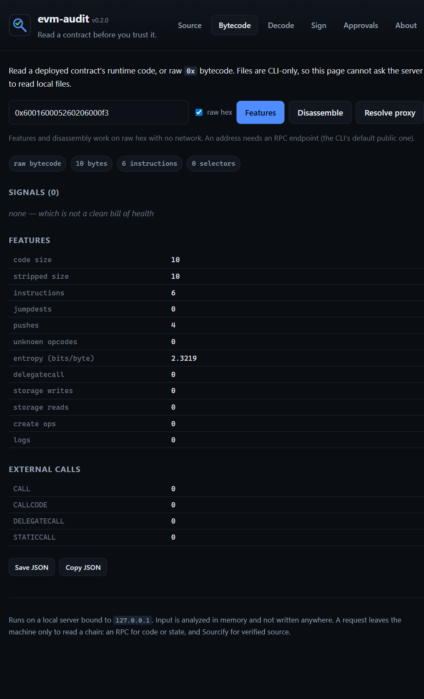

# evm-audit

[](https://github.com/0xZumii/evm-audit/actions/workflows/tests.yml)

A **zero-dependency** toolkit for EVM contract auditing and web3 threat
research. Four layers, because there are four questions to ask:

- **Bytecode layer** (`disasm`, `features`, `compare`, `resolve`) — disassemble
  runtime bytecode and report structural facts: proxies, `DELEGATECALL`
  patterns, storage writes, function selectors, compiler metadata.
- **Signature layer** (`calldata`, `typed-data`, `selector`) — decode the
  payloads that actually drain wallets: approvals, operator grants, EIP-2612
  `permit`, and Permit2 typed data.
- **EIP-712 layer** (`eip712`) — recompute EIP-712 domain separators and type
  hashes and compare them against what a contract verifies on-chain, plus
  secp256k1 signature recovery. This is where the "type string typo silently
  breaks every signature" class of bug lives.
- **Source layer** (`source`) — read the Solidity a contract was built from
  (file, directory, compiler artifact, or verified address) and report access
  control, external-call ordering, `tx.origin`, unprotected initializers,
  signature and oracle shapes. A hand-written lexer and structural pass, not a
  compiler: no solc, no tree-sitter. A local web UI (`serve`) covers every
  layer.

It is **not a security product**. It never says "safe" or "unsafe". It tells a
human what to look at. It is built to be read while learning.

## Why it exists

The original idea was a PhishingHook-style classifier (bytecode -> phishing / not).
Two honest caveats shaped this instead:

1. **Accuracy is the wrong metric.** Phishing contracts are rare, so a "90%
   accurate" model can have terrible precision and drown users in false
   positives. You need precision/recall at a chosen operating point, on
   held-out, time-split data.
2. **Bytecode misses the dominant attack.** Most current drains are *signature*
   phishing (`permit` / Permit2 / EIP-7702). The contract involved is often
   legitimate, so "does this code look malicious?" answers the wrong question.
   Hence the second layer.

This tool deliberately stops at *structural triage* — the foundation you build a
labeled dataset and (maybe) a classifier on top of.

## Install

No dependencies. Run from the project root:

```bash
python -m evm_audit --help
```

Or install the console script:

```bash
pip install -e .
evm-audit --help
```

## Usage — bytecode layer

```bash
# Disassemble a live contract
python -m evm_audit disasm 0xA0b86991c6218b36c1d19D4a2e9Eb0cE3606eB48 --limit 60

# Features + signals (human readable)
python -m evm_audit features 0xA0b86991c6218b36c1d19D4a2e9Eb0cE3606eB48

# Machine-readable features (for datasets / classifiers later)
python -m evm_audit features 0xA0b86991c6218b36c1d19D4a2e9Eb0cE3606eB48 --json

# Diff two contracts side by side
python -m evm_audit compare 0xA0b8...eB48 0x7a25...488D

# Resolve a proxy's implementation on-chain (EIP-1967 / ZeppelinOS / EIP-1167)
python -m evm_audit resolve 0xA0b86991c6218b36c1d19D4a2e9Eb0cE3606eB48 --features

# Raw bytecode, no network
python -m evm_audit features --raw 0x600160005260206000f3

# Save bytecode to a file
python -m evm_audit fetch 0xA0b86991c6218b36c1d19D4a2e9Eb0cE3606eB48 --out usdc.hex
```

## Usage — signature layer

```bash
# Derive a selector from an ABI signature (no external tools needed)
python -m evm_audit selector "approve(address,uint256)"

# Decode transaction calldata: what am I actually authorizing?
python -m evm_audit calldata 0x095ea7b3...ffff

# Decode an eth_signTypedData_v4 JSON payload (permit / Permit2 / etc.)
python -m evm_audit typed-data permit.json
cat payload.json | python -m evm_audit typed-data -
```

`calldata` and `typed-data` flag unlimited approvals, operator grants, and
permit-style authorizations in plain language, with `high` / `notable` / `info`
levels.

## Usage — EIP-712 layer

```bash
# Verify a contract's declared domain against its on-chain DOMAIN_SEPARATOR()
python -m evm_audit eip712 0xA0b8...eB48 --name "USD Coin" --version 2 --chain-id 1

# Recover the signer from a real signature over a typed-data payload
python -m evm_audit typed-data payload.json \
    --signature 0x4355...15621c \
    --signer 0xCD2a3d9F938E13CD947Ec05AbC7FE734Df8DD826

# Also compare the payload's domain against the verifying contract on-chain
python -m evm_audit typed-data payload.json --check-domain

# Batch-verify a corpus and report the observed mismatch rate
python -m evm_audit eip712-check corpus.txt
python -m evm_audit eip712-check corpus.txt --csv > results.csv

# Cross-check a corpus against the chain (catches a wrong/fabricated name)
python -m evm_audit eip712-check corpus.txt --corpus

# Discover EIP-2612 tokens and write a corpus with on-chain provenance
python -m evm_audit eip712-scan --addresses tokenlist.txt --corpus --out corpus.txt
```

### The bug this catches

An EIP-712 type string is opaque data to the compiler. `keccak256("Transfer(address,uint256)")`
with a typo — `adress` for `address` — compiles, deploys, and silently breaks
every signature: the wallet hashes what the spec says, the contract hashes what
the typo says, and the digests never match. Nothing reverts; the signature is
simply invalid forever.

You generally **cannot** find these by scraping bytecode: `solc` constant-folds
`keccak256("...")` into a `PUSH32` of the result, so the offending string is
often absent from the runtime code. So `eip712` verifies where a mismatch cannot
hide — it recomputes the separator the way a wallet would and compares it to the
contract's own `DOMAIN_SEPARATOR()`. A mismatch is reported `high`.

The EIP-712 hashing and the secp256k1 recovery are pure Python and validated
against the **spec's own published vector**: the `Mail` example in EIP-712 has a
known signature and signer, and `tests/test_eip712.py` asserts we recover the
same address. Nothing in that path is self-referential.

### Measuring instead of asserting

"Most EIP-712 implementations are broken" is easy to say and hard to support.
`eip712-check` runs the domain check over a corpus and reports what was actually
observed, so the prevalence is a number with a denominator rather than a claim.

The corpus format is one entry per line, name in quotes:

```
<address>  "Name"  <version>  [chainId]
```

The name/version matter because they are what the contract hashed into its
separator. Supplying them means pre-ERC-5267 tokens (USDC, DAI) can be checked
rather than skipped -- and if a published name/version were wrong, that shows up
as a mismatch, so the corpus documents its own inputs.

Outcomes are reported separately, and the distinction is the whole point:

| Outcome | Meaning |
| :--- | :--- |
| `ok` | Separator on-chain == separator recomputed from the declared domain |
| `mismatch` | They differ. This is the silent failure. Reported `high` |
| `unverified` | The contract uses EIP-712 but exposes no `DOMAIN_SEPARATOR()` — **not** evidence either way |
| `no_domain` | No separator and no declared domain — nothing to compare |
| `error` | Transport/decode failure. Not a verdict about the contract |

`mismatch_rate` is computed over `ok + mismatch` only. `unverified` is never
folded into `ok`, because a corpus full of contracts that *cannot* be checked
must not look like a clean bill of health.

Run against `data/eip712.corpus.example.txt` (the control group), 3 of 10
contracts are verifiable and all 3 match. The other 7 expose no
`DOMAIN_SEPARATOR()` at all. A `0.0%` rate over a 3-contract denominator is not
a result, and the tool prints the denominator so nobody quotes it as one.

### Where the corpus comes from

Hand-typing token names makes a dataset nobody can check. `eip712-scan` builds
one from the chain instead:

```bash
evm-audit eip712-scan --addresses tokenlist.txt --corpus --out corpus.txt
```

It probes each address for `DOMAIN_SEPARATOR()` (the behavioural fact that
separates an EIP-2612 token from an ordinary ERC-20) and, where the contract
implements ERC-5267, **reads the name and version out of the contract itself**.
Where it does not, the entry is written as a bare address — the tool does not
invent a name it cannot source.

The generated file records its own provenance in a header: the chain id, the
block range, and whether the addresses were discovered from logs or merely
supplied. A supplied list is labelled as *not* independently discovered, so the
file never overstates where it came from.

### The provenance gate

A corpus entry is only as good as its name. `eip712-check` will happily verify a
*fabricated* name and report `ok`, because it hashes whatever you gave it — so
before trusting a corpus, cross-check it against the chain:

```bash
evm-audit eip712-check corpus.txt --corpus
```

This asks each contract for its own ERC-5267 declaration and compares it to what
the file claims:

```
[mismatch   ] 0x7Fc6...DaE9  name: file='Totally Fake Token' chain='Aave token V3'; version: file='9' chain='2'
```

| Outcome | Meaning |
| :--- | :--- |
| `match` | The file agrees with the contract's own declaration |
| `mismatch` | The file claims something the contract contradicts |
| `no_erc5267` | No on-chain declaration to compare, so the name is unverified — not a failure, but not evidence either |

An `unverified` or `no_erc5267` entry is never counted as correct. The
cross-check deliberately passes no expected values to `verify_domain`, because
supplying them would make the function echo the file back and the check would
always pass — the circularity it exists to catch.

## Usage — source layer

The layers above read the deployed artifact. This one reads the text a human
wrote. It is a hand-written lexer plus a light structural pass -- **no solc and
no tree-sitter** -- so it is honest about being syntactic rather than semantic.

```bash
# A single file (relative imports are followed)
python -m evm_audit source contracts/MyToken.sol

# A whole project directory
python -m evm_audit source src/

# A verified contract, live (Sourcify, no API key)
python -m evm_audit source 0xA0b8...eB48 --chain-id 1

# A compiler artifact: Standard JSON input, or a Foundry out/*.json
python -m evm_audit source out/Token.sol/Token.json

# stdin, and machine-readable output
cat Foo.sol | python -m evm_audit source -
python -m evm_audit source src/ --json --min-level notable
```

For an address it asks Sourcify for the *decoded source files*, not a block
explorer's HTML. An unverified address is reported as such and produces no
findings -- which is not the same as a clean result.

### What it reports

Findings carry a rule id, a level (`high` / `notable` / `info`), a file and
line, and a reason. The rules are deliberately syntactic, and every one is a
place to look rather than a claim:

| Rule | Level | What it points at |
| :--- | :--- | :--- |
| `tx-origin` | high | `tx.origin` gates a check; an intermediary can pass it for the victim |
| `selfdestruct` | high | `selfdestruct` / `suicide` reachable in source |
| `selfdestruct-in-proxy` | high | `selfdestruct` in a file that also uses `delegatecall`: destroying logic behind a proxy |
| `unprotected-initializer` | high | `initialize()` with no `initializer` modifier: front-runnable on a proxy |
| `missing-access-control` | high / notable | externally callable sensitive function with **no modifier at all** and no `msg.sender` check |
| `delegatecall-target` | high / notable | `delegatecall` whose target comes from `msg.sender` or a parameter |
| `unchecked-call` | high / notable | return of `call`/`send`/`transfer` ignored; `send`/ERC-20 are silent on failure |
| `state-after-call` | notable | a state variable written after an external call, no `nonReentrant` |
| `oracle-staleness` | notable | Chainlink `latestRoundData` / `latestAnswer` with no `updatedAt` staleness check |
| `spot-price-oracle` | notable | `getReserves` / `slot0`, or a `balanceOf` ratio, used as a price (flash-loan movable) |
| `ecrecover-zero` | notable | `ecrecover` result not checked against `address(0)` in that function |
| `signature-nonce` | notable | `ecrecover` with no nonce / replay guard visible anywhere in the file |
| `signature-chainid` | info | `ecrecover` with no chain id or EIP-712 domain separator visible in the file |
| `weak-randomness` | notable | `keccak256` over `block.timestamp` / `blockhash` / `prevrandao` |
| `pre-0.8-pragma` | notable | solc < 0.8: no built-in overflow checks |
| `assembly` | notable | inline assembly; safety checks do not apply there |
| `unclear-access-control` | info | sensitive function guarded only by a modifier whose name is not obviously access control |
| `unchecked` | info | `unchecked { }` block |
| `encode-packed` | info | `abi.encodePacked` used with multiple arguments |
| `hardcoded-32-bytes` | info | a 32-byte hex literal (role hash, salt, or a leaked secret) |
| `assert` | info | `assert()` used where `require()` belongs |
| `self-balance` | info | `address(this).balance` assumed to reflect accounting |
| `floating-pragma` | info | `^` / `>=` pragma: the deployed compiler may differ |
| `ecrecover` | info | `ecrecover` used at all |

Structural facts are reported alongside: contracts and their bases, functions
with visibility/mutability/modifiers/line, and state variables with type and
line.

### The difference from a bytecode scanner

`delegatecall`, checked call returns, and `tx.origin` cannot be recovered
reliably from opcodes: `solc` constant-folds and inlines, and the source's
structure is gone. But a string-based scanner lies -- a `}` inside a string
literal, or `tx.origin` inside a comment, is not code. So this tokenizes first,
keeps line numbers, and reads braces as structure. `tests/test_source.py`
pins that: a contract named `Fake` inside a comment and `"..."` containing
`}` must not change the parse.

### What it cannot do -- stated, not hidden

- **Inheritance is not resolved.** A modifier or state variable defined in a
  base contract is invisible unless named in the same file. A guard you cannot
  see is not reported as missing; it is reported as *unclear*, at `info`.
- **Types are not checked.** A name is only a name.
- **Control flow is not evaluated.** "Checked three statements later" cannot be
  told from "checked on every path", and a `require` may itself be bypassable.
- **Artifacts without source text.** Foundry's `out/*.json` keeps the AST and
  ABI but not the source. Those are reported as structural facts only, with the
  source rules explicitly marked as not run.

No finding is a verdict, and the absence of findings is not a clean bill of
health.

### A local web UI for every layer

The analyzers are Python, so the page cannot run them in the browser — but the
server can, and it is still stdlib-only:

```bash
python -m evm_audit serve              # http://127.0.0.1:8787/
python -m evm_audit serve --open --port 9000
```

The page has a tab per layer, and each tab calls the same function the CLI does:

| Tab | What it calls | Leaves the machine only to |
| :--- | :--- | :--- |
| Source | `source` (file text, artifact, or a Sourcify address) | RPC + Sourcify |
| Bytecode | `features`, `disasm`, `resolve` | RPC (not for raw hex) |
| Decode | `calldata`, `selector` | nowhere — fully local |
| Sign | `typed-data` (+ optional domain check), `eip712` | RPC only if you ask |
| Approvals | `allowances` | RPC (bounded by lookback and max calls) |

It binds to `127.0.0.1`, analyzes in memory, and writes nothing. File paths are
deliberately CLI-only: the bytecode tab accepts an address or raw `0x` hex, so a
page bound to a wider interface cannot ask the server to read local files. The
page never sets `innerHTML` from anything derived from the contract it is
reading, so a function name cannot inject markup into the page reading it.

The endpoints are `POST /api/analyze`, `/api/features`, `/api/disasm`,
`/api/calldata`, `/api/typed-data`, `/api/selector`, `/api/eip712`,
`/api/allowances`, and `GET /api/address` and `/api/resolve`.

Every tab that produces a result offers **Save JSON** and **Copy JSON**, so
what you read can be kept or handed to someone else. Big integers are sent as
strings on the wire: a JavaScript number cannot hold a `uint256` allowance
exactly, and a rounded allowance is worse than none.

#### Screenshots

The source tab, after analyzing the bundled example — findings, their levels,
the `not checked` list, and the export buttons:



The bytecode tab, reading raw hex with no network — features, external-call
counts and proxy detection:



## Deploying the web UI

`python -m evm_audit serve` is a long-lived local server: it binds `127.0.0.1`
and runs the analyzers in-process. That is the right shape for a laptop, and it
is **not** what Vercel runs.

### Vercel

Vercel runs functions, not servers. The analysis is already a set of pure
functions, so `api/*.py` wraps each one as a WSGI app (through
`evm_audit/vercel.py`) and Vercel serves `evm_audit/web/` as static assets:

```
vercel.json          outputDirectory, and the /api/typed-data rewrite
requirements.txt     empty -- the package has no runtime dependencies
api/*.py             one function per endpoint
evm_audit/vercel.py  the WSGI adapter
```

```bash
npm i -g vercel
vercel            # a preview deployment
vercel --prod     # production
```

Three things to know before pointing it at the public:

1. **Set `EVM_AUDIT_RPC`.** Without it the functions use the free public
   endpoints, which rate-limit datacenter IPs — and a serverless function looks
   exactly like one. Any Ethereum JSON-RPC URL works:

   ```bash
   vercel env add EVM_AUDIT_RPC production
   ```

2. **The Approvals tab is disabled.** That layer issues hundreds of
   `eth_getLogs` calls and will not fit a serverless timeout, so
   `/api/allowances` answers `501` and the page disables the tab. The other four
   layers fit. This is stated, not hidden — `/api/health` reports
   `"allowances": false` and the UI acts on it.

3. **Request bodies are capped at 4 MB** (Vercel's limit is near 4.5 MB), down
   from the local server's 8 MB.

The `/api/typed-data` path keeps its hyphen through a `vercel.json` rewrite: a
Vercel Python entrypoint is imported as a module, so the file cannot be named
with one.

### A long-lived host instead

If you want the whole tool — Approvals included — run the server as a web
service on Render, Railway, Fly.io or a VPS:

```bash
python -m evm_audit serve --host 0.0.0.0 --port "$PORT"
```

The same process as the laptop one, just reachable. A word of honesty: there is
**no authentication**, and everyone shares your outbound RPC. Treat it as a
public read-only tool and set `EVM_AUDIT_RPC` to an endpoint you control.

## Usage — approval exposure

The payload layers above read a payload. This one asks the opposite question:
*forget payloads — what can be done to this address without another
signature?* An approval is a standing instruction that outlives the transaction
that created it and survives the dapp that requested it, and a wallet never
shows you the set of them.

```bash
# What can be taken from this address right now?
python -m evm_audit allowances 0xOwner...

# Give it a real token list (plain addresses, or a token-list JSON)
python -m evm_audit allowances 0xOwner... --tokens tokenlist.json

# Widen the history (the default looks back 20,000 blocks)
python -m evm_audit allowances 0xOwner... --lookback 500000

# Include revoked and expired rows; machine-readable output
python -m evm_audit allowances 0xOwner... --all
python -m evm_audit allowances 0xOwner... --json
python -m evm_audit allowances 0xOwner... --csv > exposure.csv
```

It finds candidates through `eth_getLogs` and then re-reads current state for
every one of them:

| Event | What it grants | Re-read with |
| :--- | :--- | :--- |
| `Approval(owner, spender, value)` | ERC-20 allowance (ERC-721's per-tokenId approval shares this topic) | `allowance(owner, spender)` |
| `ApprovalForAll(owner, operator, bool)` | control of an entire NFT collection | `isApprovedForAll(owner, operator)` |
| Permit2 `Approval` / `Permit` | a token allowance held by Permit2 | Permit2 `allowance(owner, token, spender)` |

**Logs are the sieve; the state read is the truth.** A log says an approval went
in; only the current read says whether it is still there. So the statuses are
deliberately not binary:

| Status | Meaning |
| :--- | :--- |
| `unlimited` / `operator` | active, and unbounded by amount. Near-max counts: protocols commonly approve max minus a reserve |
| `active` | active and finite; exposure is `min(allowance, balance)` |
| `expired` | Permit2 only, past its expiration — no longer exercisable |
| `self` | the spender is the owner; grants nothing, so it is **not** counted as exposure |
| `revoked` | read OK, and currently zero/false |
| `unreadable` | the read failed — **not** a revocation, and never rendered as clean |

Each spender is also classified from its code: an EOA (a key can take), a
contract, or an EIP-7702-delegated account.

### What it does not do — stated, not hidden

There is no on-chain enumerator for allowances: `allowance(owner, spender)`
needs the spender, and nothing returns the list of spenders. So the report is
bounded by the block range scanned and the token list supplied, and it prints
both bounds plus everything it could not read:

- an approval granted before the scanned range, or on a token not in the list, is invisible here;
- ERC-721 per-tokenId approvals and marketplace listings are not quantified;
- no USD valuation is computed — there is no price feed, and none is invented.

"No active approvals found" means none in what was scanned. It is not "safe".

Public nodes cap `eth_getLogs` (PublicNode refuses more than nine addresses in
one filter, and the cap is undocumented and provider-specific), so a rejected
filter is split automatically — addresses first, then the block range — and a
genuine outage stops the scan rather than fanning out into thousands of doomed
requests.

## What it extracts

Bytecode layer:

- size / instruction count / jumpdest count / bytecode entropy
- opcode histogram; external calls (`CALL`/`CALLCODE`/`DELEGATECALL`/`STATICCALL`)
- storage reads/writes, creates, logs, undefined opcode bytes
- recovered 4-byte function selectors from the dispatch pattern
- proxy detection: EIP-1167 minimal proxy, EIP-1967 + ZeppelinOS + EIP-1822 slots
- Solidity metadata: compiler version + IPFS multihash
- jump targets resolved against valid `JUMPDEST` positions
- `risk_signals`: plain-language observations, never a verdict

Signature layer:

- 4-byte selector derivation via pure-Python Keccak-256
- calldata decoding for `approve`, `increaseAllowance`, `setApprovalForAll`,
  `transferFrom`, `safeTransferFrom`, EIP-2612 `permit`, and Permit2
- EIP-712 typed-data flattening with high-risk type detection

EIP-712 layer:

- `encodeType` / `typeHash` / `hashStruct` / `domainSeparator` per EIP-712,
  including referenced-struct collection and array hashing
- digest computation (`keccak256(0x1901 ‖ domainSeparator ‖ hashStruct(message))`)
- ERC-5267 `eip712Domain()` decoding (including the `fields` bitmask) and
  EIP-2612 `DOMAIN_SEPARATOR()` comparison
- pure-Python secp256k1 public-key recovery and EIP-55 checksummed addresses

Approval-exposure layer:

- discovery over four event signatures in a single `eth_getLogs` filter, because
  all four put the owner at topic 1
- current-state re-reads: `allowance(owner, spender)`,
  `isApprovedForAll(owner, operator)`, and Permit2's packed
  `allowance(owner, token, spender)` (`uint160` amount ‖ `uint48` expiration ‖
  `uint48` nonce)
- exposure as `min(allowance, balance)`, so an unlimited grant to an empty
  address is not reported as a loss
- spender classification: EOA / contract / EIP-7702 delegation designator
- tolerant `symbol()` / `decimals()` decoding, with control characters stripped
  before a token-controlled string is printed
- adaptive `eth_getLogs` splitting for provider filter caps, with outage
  detection so a dead endpoint stops the scan instead of fanning out

Source layer:

- a Solidity lexer that strips comments and keeps string literals as single
  tokens (so `}` inside a string is not structure), preserving line numbers
- contract / function / modifier / state-variable structure, with inheritance
  bases, visibility, mutability and modifier names
- statement-scoped rules over the token stream, and function-scoped rules that
  use declared state-variable names to place a write relative to an external call
- `abi.encodePacked` / `keccak256` argument shapes, pragma interpretation, and
  32-byte hex literals
- verified-source fetch from Sourcify (v2 API, no key), and extraction of
  sources, AST facts, and ABI signatures from compiler artifacts

## Design notes for a learner

- `keccak.py` — Keccak-256 from scratch (Ethereum's variant, *not* SHA3-256).
  Selectors are `keccak256(signature)[:4]`; verified against known vectors.
- `disasm.py` — the core lesson: bytecode must be walked sequentially because
  `PUSH1..PUSH32` carry immediate data. Walk byte-by-byte and you invent fake
  opcodes, including fake `JUMPDEST`s. Metadata stripping lives here too.
- `opcodes.py` — the full opcode table as plain data. Read it; that *is* the EVM.
- `features.py` — heuristics, each with a note explaining why the opcode matters.
- `abi.py` / `signatures.py` — the payload layer, where the drains actually are.
- `resolve.py` — proxy implementation resolution across storage schemes.
- `rpc.py` — JSON-RPC via stdlib `urllib` (`eth_getCode`, `eth_getStorageAt`).
- `allowances.py` — the inverse question: not "what does this payload do?" but
  "what can be done *without* one?" The log is the sieve, the state read is the
  truth, and `unreadable` is never folded into `revoked`.
- `sol_source.py` — the fourth layer, and the lesson in why a lexer beats a
  regex: comments and string literals are removed *as tokens*, so a `}` in a
  string cannot be structure and `tx.origin` in a comment is not a finding. The
  parser is intentionally shallow (no inheritance, no types, no control flow),
  and every rule states the assumption it is making.
- `sourcify.py` — verified source with no API key. `unverified` (HTTP 404) is a
  distinct outcome from "we could not ask"; neither is a clean result.
- `server.py` — the local web UI, `http.server` only. It serves `web/` and one
  JSON endpoint per layer. Every handler is a pure function of its request, so
  the routing and the payloads are tested without starting a server. The bind
  is deliberate: `SO_EXCLUSIVEADDRUSE` on Windows, so a second `serve` fails
  loudly instead of silently sharing a port and splitting connections.
- `web/` — a static page (no framework, no build step) in the same visual
  language as the other tools. Untrusted contract text is only ever set with
  `textContent`, never `innerHTML`.
- `vercel.py` — a WSGI adapter: it turns each pure handler into a Vercel
  function, keeps big integers exact on the wire, and answers `501` for the
  layer that needs a long-lived server. `api/*.py` are the one-line entrypoints.

## Known limitations (by design, for now)

- **Linear disassembly sees data as code.** Embedded revert strings look like
  undefined opcodes. A nonzero "unknown opcode" count is not by itself evidence
  of obfuscation. This is a fundamental limit of linear sweep, not a bug.
- **Selector recovery is heuristic.** It keys off `PUSH4` near `EQ`/`SHL`, so it
  can both miss selectors and, rarely, report non-selectors.
- **EIP-7702 delegations are not covered yet** — the newest drain vector.
- **Permit2 `permitBatch` args are recognized but not expanded.**
- **EIP-712 struct type strings cannot be read out of arbitrary bytecode.**
  `eip712` verifies the *domain separator* behaviourally (declaration vs.
  on-chain value), which catches typos in domain fields. A typo inside a
  *message* struct's type string (e.g. in `Permit`) is not detected unless you
  supply the payload and a signature, in which case recovery fails and says so.
- **The source layer is syntactic, not semantic.** It does not resolve
  inheritance, check types, or evaluate control flow, so a guard inherited from
  a base contract reads as *unclear* (at `info`) rather than present. See
  "What it cannot do" above.
- **A verified source is not a verified deployment.** Sourcify matching the
  runtime bytecode is provenance, not proof of intent, and the deployed proxy's
  implementation is a separate address to read.
- **Not a safety oracle.** Everything is a signal for a human, never a verdict.

## Tests

```bash
python -m unittest discover -s tests -v
```

156 tests: disassembly (push data, jumpdests, metadata), Keccak-256 vectors,
derived selectors, calldata decoding, typed-data analysis, EIP-712
(encodeType, domain separators, ERC-5267 decoding, secp256k1 recovery against
the spec's `Mail` vector), corpus parsing, batch classification, log-scan
pagination and failure handling, corpus rendering, and the provenance gate.
The approval-exposure tests pin derived topics against published values, and
cover event decoding, the near-max and self-approval rules, adaptive filter
splitting, and outage handling — including the invariant that a failed state
read is never reported as a revocation.

The source tests pin the lexer first: a `contract Fake` inside a comment and a
`}` inside a string literal must not appear as structure, and line numbers must
survive block comments. On top of that they check each rule's level and its
suppression case — `require`-wrapped calls are not `unchecked-call`, `onlyOwner`
is not `missing-access-control`, a modifier whose name is not access-control is
`unclear` at `info` and not `high`, `nonReentrant` clears `state-after-call`,
and `address(0)` clears `ecrecover-zero`. Artifact and import handling are
covered too, including that a `@openzeppelin` import is *not* silently invented.

The web handlers are tested as plain functions, without a server: selector
derivation, features and disassembly from raw hex, an unlimited-approval
calldata decode, the refusal to accept a file path through the bytecode
endpoint, and that a `uint256` is serialized to the page as an exact string
rather than a rounded number.

The Vercel adapter is tested as WSGI, offline: a good request, a wrong method
(`405`), malformed JSON (`400`), an oversized body (`413`, refused *before* the
body is read), an exact big integer surviving the round trip, and the allowance
endpoint answering `501`.

## Known limits of discovery

- **Topics-only `eth_getLogs` is rejected by most public nodes** ("address is
  required"). `eip712-scan` without `--addresses` therefore returns
  `log errors: N ranges failed` and finds nothing. Use `--addresses` with a
  token list; that path needs no log scan and works on the free endpoints.
- **Discovery is filtered by `DOMAIN_SEPARATOR()`, nothing more.** A contract
  that answers it is treated as EIP-2612. That is a behavioural fact, not proof
  of correctness — which is what `eip712-check` is for.
- **The EIP-712 type strings still cannot be read from bytecode**, so a corpus
  can only ever describe *domain* fields, never a message struct's type string.

## Next steps

1. Add labels to `data/labels.example.json` from real sources (block-explorer
   labels, public drainer research, or your own tracing). Never guess a label.
2. Run `features --json` over the set and find separators **by hand** before
   reaching for ML.
3. Add `eth_getLogs` to `rpc.py` for deployer/funding graphs (tracing + auditing).
4. Add EIP-7702 delegation decoding to the signature layer.
5. **Grow the corpus until the number means something.** `eip712-check` is built,
   but a 3-contract denominator proves nothing. The work now is assembling a few
   hundred ERC-2612 deployments with their name/version, running the batch, and
   publishing the distribution — then the claim about silent EIP-712 failures is
   an observation with a denominator, not a repeated statistic.
6. Only then a classifier — evaluated with precision/recall at an operating
   point, time-split, not random-split.
7. **Use `source` as the entry point.** Read the verified source first for
   access control and call ordering, then `features` on the implementation and
   `resolve` on the proxy. A source finding is a hypothesis the bytecode either
   supports or leaves open — cross-read the two, and never let one layer's
   silence stand in for the other's.

## Funding / research framing

This lands as a **research/public-good** contribution, not a consumer product:
grants (Ethereum Foundation ecosystem support, L2 retro public goods, Gitcoin),
bug bounties, and reputation in web3 security collectives. The scarce resource
is a labeled, time-split, attributed dataset — exactly what
practitioner-collected samples produce.
